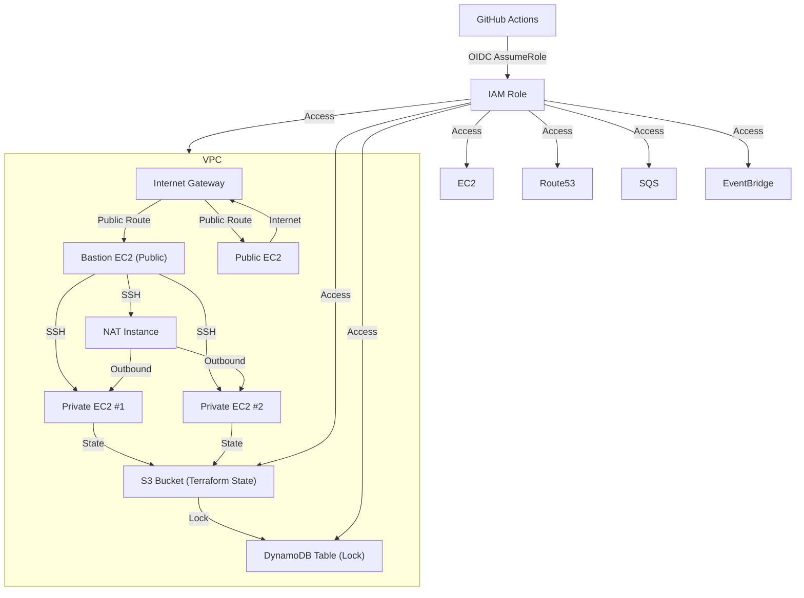

# Terraform AWS Infrastructure Setup

## Overview

This project provisions a secure, production-ready AWS infrastructure using Terraform. It is modular, follows best practices, and is designed for use with CI/CD via GitHub Actions and OIDC authentication.

---

## Architecture Diagram



---

## Features

- VPC with public and private subnets across two AZs
- Internet Gateway, NAT Instance for outbound access
- Bastion host for secure SSH access
- Public and private EC2 instances
- Security groups for strict access control
- S3 bucket for remote Terraform state (with versioning & encryption)
- DynamoDB table for state locking
- IAM role for GitHub Actions with OIDC authentication
- CI/CD pipeline with GitHub Actions

---

## Resource Summary

| Resource Type   | Name/Count                     | Purpose                               |
| --------------- | ------------------------------ | ------------------------------------- |
| VPC             | 1                              | Isolated network for all resources    |
| Subnets         | 2 public, 2 private            | Segregate public/private resources    |
| IGW             | 1                              | Internet access for public subnets    |
| NAT Instance    | 1                              | Outbound internet for private subnets |
| EC2 Instances   | 1 Bastion, 1 Public, 2 Private | Compute resources, SSH access         |
| Security Groups | 3                              | Access control for EC2/NAT            |
| S3 Bucket       | 1                              | Terraform remote state                |
| DynamoDB Table  | 1                              | Terraform state locking               |
| IAM Role        | 1                              | GitHub Actions OIDC access            |
| OIDC Provider   | 1                              | GitHub Actions authentication         |

---

## File/Module Structure

| File/Folder                | Purpose                                               |
| -------------------------- | ----------------------------------------------------- |
| `main.tf`                  | Main Terraform config, provider, and data sources     |
| `variables.tf`             | Input variables and defaults                          |
| `outputs.tf`               | Outputs for use after apply                           |
| `network.tf`               | VPC, subnets, route tables, associations              |
| `compute.tf`               | EC2 instances, key pairs                              |
| `security.tf`              | Security groups                                       |
| `nat.tf`                   | NAT instance and routing                              |
| `s3_dynamodb_resources.tf` | S3 bucket and DynamoDB table for state/locking        |
| `iam.tf`                   | IAM roles, policies, OIDC provider for GitHub Actions |
| `backend.tf`               | Remote backend config for Terraform state             |
| `providers.tf`             | Provider configuration                                |
| `data.tf`                  | Data sources (caller identity, region)                |
| `.github/workflows/`       | GitHub Actions workflows (CI/CD)                      |
| `.github/actions/`         | Custom GitHub Actions (setup-terraform)               |

---

## Prerequisites

- [Terraform](https://www.terraform.io/downloads.html) (>= 1.0)
- [AWS CLI](https://aws.amazon.com/cli/)
- AWS account with admin or required permissions
- GitHub repository (for CI/CD)

---

## Configuration

### Variables

| Name                   | Default Value                            | Description                    |
| ---------------------- | ---------------------------------------- | ------------------------------ |
| `github_repository`    | "amineodjn/rsschool-devops-course-tasks" | GitHub repo in org/repo format |
| `aws_region`           | "eu-central-1"                           | AWS region                     |
| `aws_account_id`       | "679128292768"                           | AWS Account ID                 |
| `vpc_cidr`             | "10.0.0.0/16"                            | VPC CIDR block                 |
| `public_subnet_cidrs`  | ["10.0.1.0/24", "10.0.2.0/24"]           | Public subnet CIDRs            |
| `private_subnet_cidrs` | ["10.0.101.0/24", "10.0.102.0/24"]       | Private subnet CIDRs           |
| `azs`                  | ["eu-central-1a", "eu-central-1b"]       | Availability zones             |

Override variables via `terraform.tfvars` or CLI args.

### Backend

Remote state is stored in S3 with locking via DynamoDB:

```hcl
terraform {
  backend "s3" {
    bucket         = "terraform-devops-course-11579"
    key            = "global/s3/terraform.tfstate"
    region         = "eu-central-1"
    encrypt        = true
    dynamodb_table = "terraform-lock"
  }
}
```

---

## Usage

1. **Clone the repository:**
   ```sh
   git clone <your-repo-url>
   cd <project-directory>
   ```
2. **Configure AWS credentials:**
   - Use `aws configure` or environment variables.
3. **Initialize Terraform:**
   ```sh
   terraform init
   ```
4. **Plan changes:**
   ```sh
   terraform plan
   ```
5. **Apply changes:**
   ```sh
   terraform apply
   ```
6. **Destroy resources:**
   ```sh
   terraform destroy
   ```

### Outputs

- `vpc_id`, `public_subnet_ids`, `private_subnet_ids`, `bastion_public_ip`, `bastion_private_key_pem`, `private_vm_private_ips`

---

## CI/CD with GitHub Actions

- **Workflow:** `.github/workflows/terraform.yml`
  - Checks formatting, runs `plan` on PR, and `apply` on main branch push.
- **OIDC Authentication:**
  - Uses a custom action (`.github/actions/setup-terraform`) to assume an AWS IAM role via OIDC for secure, keyless authentication.
- **Required Secrets:**
  - `AWS_ACCOUNT_ID` in GitHub repository secrets.

---

## IAM & Security

- **IAM Role:**
  - Created for GitHub Actions with OIDC trust and least-privilege policies for EC2, S3, DynamoDB, VPC, Route53, SQS, EventBridge.
- **OIDC Provider:**
  - Configured for GitHub Actions (`token.actions.githubusercontent.com`).
- **Security Groups:**
  - Bastion: SSH from anywhere
  - Private VMs: SSH only from Bastion
  - NAT: SSH from Bastion, ICMP from anywhere

---

## State Management

- **S3 Bucket:**
  - Stores Terraform state, versioned and encrypted.
- **DynamoDB Table:**
  - Manages state locking to prevent concurrent changes.

---

## Extending/Customizing

- Add new resources in separate `.tf` files or modules.
- Adjust variables in `variables.tf` or via `terraform.tfvars`.
- Update GitHub Actions workflow as needed for your process.

---

## Troubleshooting & Notes

- Ensure AWS credentials and permissions are correct.
- Review `terraform plan` before applying.
- For CI/CD, ensure OIDC role and provider are set up in AWS.
- For issues with state, check S3 and DynamoDB resources.

---

## References

- [Terraform Docs](https://www.terraform.io/docs/)
- [AWS Provider Docs](https://registry.terraform.io/providers/hashicorp/aws/latest/docs)
- [GitHub Actions OIDC](https://docs.github.com/en/actions/deployment/security-hardening-your-deployments/about-security-hardening-with-openid-connect)
